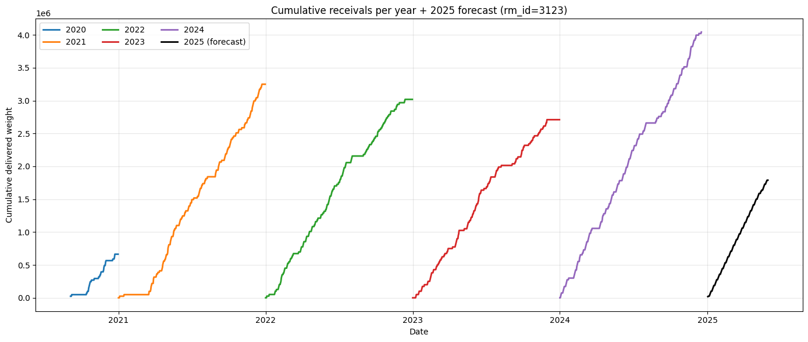
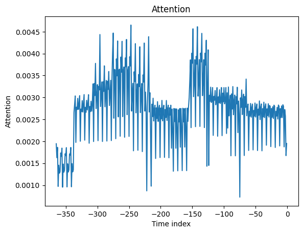
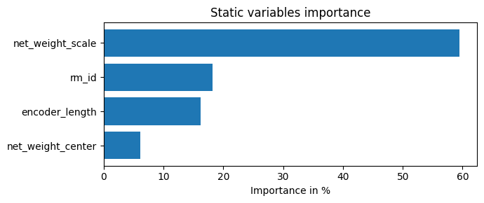
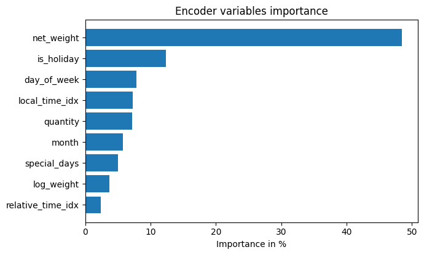
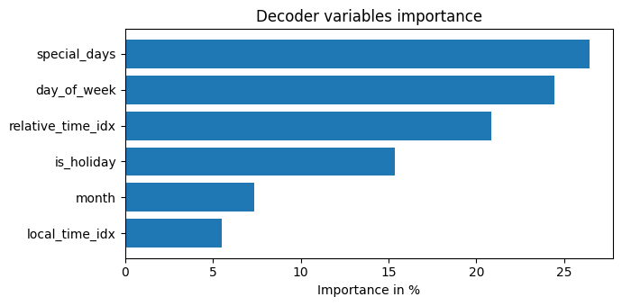

# Project: Time Series Forecasting with Temporal Fusion Transformer (TFT)

This repo contains our solution for a real-world multivariate time series forecasting task (Kaggle-style): predicting future material receivals using historical purchase orders + calendar features.

## Sample prediction

The plot above shows a material (rm_id 3123) which has been arriving since late 2020. We can see that our model (TFT) predicts a very *smooth* trajectory, as opposed to the actual receivals from the past, which are more volatile. This is a common pattern with TFT, which is designed to capture overall trends and patterns rather than short-term noise. Nevertheless, TFT was trained using data on when public holidays are, so it does indeed predict *zero increase* during weekends and holidays.

## Features importances

## Highlights

- **Model**: Temporal Fusion Transformer (TFT), combining sequence modeling and attention to capture non-linear temporal effects in multivariate data.

- **Result**: In our experiments, TFT outperformed traditional baselines like XGBoost and achieved a public leaderboard score of 3295, placing us in top 10 out of 150 participants.

- **Interpretability**: We use TFT’s built-in interpretability tools (variable importances + attention weights) to understand what the model relied on and which time ranges mattered most.

## Repo structure (where to look)

- `submission/` – runnable notebooks + environment files (main entry point)
  - `Short_notebook_1.ipynb` – end-to-end pipeline (data prep → training → submission)
  - `Short_notebook_2_MORE_FEATURES.ipynb` – extended feature set / experimentation
  - `pyproject.toml`, `uv.lock` – reproducible environment
- `report.ipynb` – the full report: modeling choices, results, and interpretability plots.

## Why TFT worked well here

TFT is particularly strong when:

- you have many time-varying covariates (calendar features, lag features, rolling stats, etc.)
- patterns depend on both short-term dynamics and longer seasonal structure
- you need a model that is not just accurate, but also explainable through attention + feature attribution

## Model interpretation (what the model actually used)

Two things we looked at:

### 1 - Encoder variable importance

We inspected which time-varying inputs in the history window the model leaned on.`net_weight` dominated, suggesting recent receivals carry strong predictive signal; calendar signals like `is_holiday` and `day_of_week` were also relevant drivers.

### 2 - Attention over past time steps

We also plotted attention weights to see which parts of the history window were most informative. The model placed roughly even attention across many timesteps, with a gradual decline for much older history; recent history mattered slightly more for forecasting.

## Reproducibility / running the notebooks

The environment is defined in `submission/` via `uv` (pyproject.toml + uv.lock). The intended workflow is:

1. `cd submission/`
2. create/sync env with `uv sync`
3. create ipynb kernel with `uv run ipykernel install --user --name=tft-env`
4. run the notebook(s), starting with Short_notebook_1.ipynb (select the tft-env kernel in Jupyter)

## Outputs

- notebook-based analysis + plots
- generated submission files (see submission/ workflow)
- full interpretation in report.ipynb
