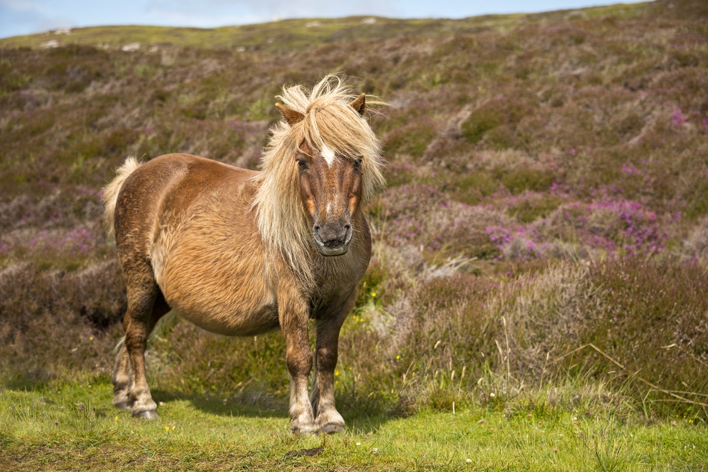

# HobbyHorsing101

Description of the files given to the students

- [HobbyHorsing101](#hobbyhorsing101)
  - [Data files](#data-files)
    - [Core data](#core-data)
    - [Extended data (optional)](#extended-data-optional)
  - [Sample submission files](#sample-submission-files)
  - [Documentation](#documentation)

## Data files

### Core data

- [`data/kernel/receivals.csv`](data/kernel/receivals.csv) - training data (mandatory)
- [`data/kernel/purchase_orders.csv`](data/kernel/purchase_orders.csv) - important data that contains whats ordered (optional but recommended)

### Extended data (optional)

- [`data/extended/materials.csv`](data/extended/materials.csv) - optional data related to the different materials
- [`data/extended/transportation.csv`](data/extended/transportation.csv) - optional data related to transportation

## Sample submission files

- [`data/prediction_mapping.csv`](data/prediction_mapping.csv) - mapping used to generate submissions
- [`data/sample_submission.csv`](data/sample_submission.csv) - demo submission file for Kaggle, predicting all zeros

## Documentation

- [`Dataset_definitions_and_explanation.pdf`](Dataset_definitions_and_explanation.pdf) - a document that gives more details about the dataset and column names
- [`Machine_learning_task_for_TDT4173.pdf`](Machine_learning_task_for_TDT4173.pdf) - brief introduction to the task
- [`kaggle_metric.ipynb`](kaggle_metric.ipynb) - the score function we use in the Kaggle competition
